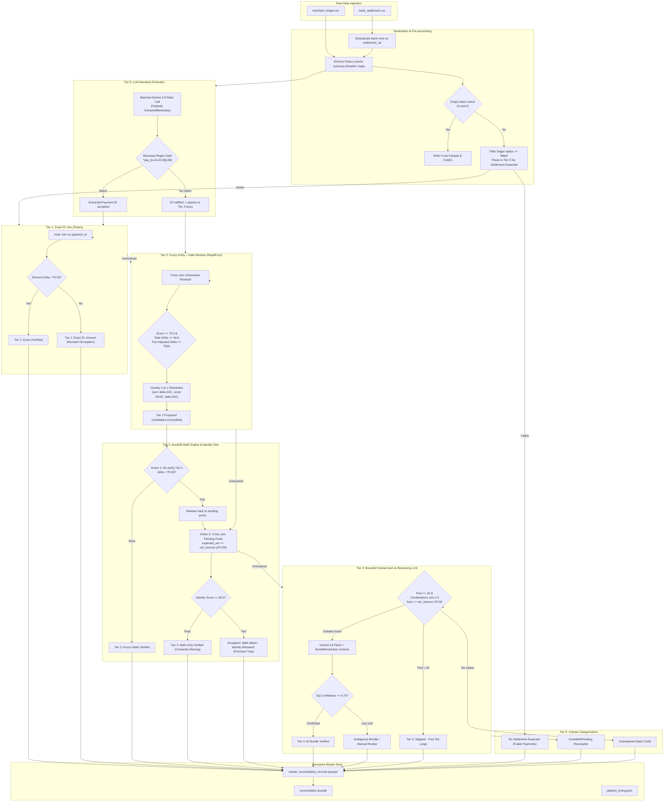

<div align="center">

# 🏦 AI Finance Controller
### Razorpay Buildathon 2026 — Track 04

*A production-grade, tiered reconciliation engine that closes the loop between merchant payment ledgers and bank settlement data — deterministically, auditably, at scale.*

[](https://www.python.org/)
[](https://pola.rs/)
[](https://duckdb.org/)
[](https://streamlit.io/)
[](https://ai.google.dev/)
[](https://docs.pydantic.dev/)
[](https://github.com/maxbachmann/RapidFuzz)
[](LICENSE)

**🏆 Built for Razorpay Buildathon 2026 — Track 04: AI Finance Controller**

[▶ Demo Video](https://drive.google.com/file/d/1G48viY3KmxUUJzZgh69988a7MQfnAoIz/view?usp=sharing) • [Architecture](#architecture) • [Tech Stack](#tech-stack) • [Quick Start](#quick-start) • [Pipeline](#pipeline-deep-dive) • [Docs](docs/README.md)

</div>

---

> *"The 2026 builder consensus: verification capacity, not generation speed, is the bottleneck. Reconciliation, settlement and forecasting are still done by hand."*
>
> *"Throughput plus measured accuracy plus an honest exception list. One cherry-picked match proves nothing."*

---

## Overview

**AI Finance Controller** is an asymmetric, deterministic-first reconciliation system that matches merchant payment records against bank settlement credits across six escalating tiers — from sub-millisecond exact joins to bounded LLM reasoning on genuinely ambiguous bundles. Every record lands in exactly one category. No leaks. No double-counts. Full audit trail.

The system answers three of the four named directions in Track 04:

| Capability | Description | Source File |
|---|---|---|
| 🔗 **Multi-source Reconciliation** | 6-tier pipeline (exact ID → fuzzy → math → AI bundle) | [`3_reconciliation_pipeline.py`](src/3_reconciliation_pipeline.py) |
| 💬 **Settlement Q&A Agent** | Natural language → read-only SQL over the master ledger | [`qa_agent.py`](src/qa_agent.py) |
| 📈 **Cash Flow Forecaster** | Aging-bucket inflow projection based on observed T+2 lag | [`forecaster.py`](src/forecaster.py) |

---

## Results

<div align="center">

| Metric | Value |
|:---|:---|
| 📦 Batch size | 64 records (48 bank-anchored + 16 ledger-only) |
| 🎯 Matchable denominator | **57 records** *(7 failed payments excluded)* |
| ✅ Match rate | **50.9%** |
| ✔️ Verified matches | **29** |
| ⚠️ Exceptions flagged | **28** |
| 💰 Verified gross processed | **₹6,90,782.03** |
| ⏱️ Total pipeline runtime | **59.0 s** |
| 🚀 Throughput | **1.09 records / sec** |
| ⚙️ Deterministic tier time | 2.8 s (4.8%) |
| 🤖 LLM tier time | 56.1 s (95.2%) |

</div>

**The conservation invariant is enforced at pipeline exit:**
```
bank_rows_in  ==  verified  +  exceptions  +  orphans
     48        =     29     +     11       +    8       ✓
```
One cherry-picked match proves nothing. This table proves everything is accounted for.

<details>
<summary><b>Per-stage timing breakdown</b></summary>

| Stage | Method | Duration | % of Total |
|---|---|---|---|
| Tier 0 | Gemini LLM batch extraction | 21.3 s | 36.2% |
| Tier 1 | Polars exact ID join | 0.02 s | 0.0% |
| Tier 2 | RapidFuzz cross-join | 0.05 s | 0.1% |
| Tier 3 | DuckDB math + identity veto | 2.75 s | 4.7% |
| Tier 4 | Subset-sum + Gemini reasoning | 34.8 s | 59.1% |

Tiers 1–3 complete in **< 3 seconds combined**. The LLM is only invoked on cases that deterministic arithmetic cannot resolve.

</details>

---

## Screenshots

<div align="center">

| 📊 Dashboard | 📋 Audit Trail |
|:---:|:---:|
|  |  |

| 💬 Settlement Q&A | 📈 Cash Forecast |
|:---:|:---:|
|  |  |

</div>

---

## Architecture

> **The thesis:** Cheap, deterministic arithmetic runs first. The LLM is a last-resort escalation path — not a default. In financial reconciliation, ground truth is mathematical conservation. The LLM produces plausible suggestions; determinism produces an auditable record. A financial controller must always strictly prefer the latter.

### Pipeline Overview

```
merchant_ledger.csv ──┐
                      ├──► [Pre-processing] ──► [Tier 0] ──► [Tier 1] ──► [Tier 2]
bank_settlement.csv ──┘         │                                              │
                                │                                              ▼
                           (empty batch)                                  [Tier 3]
                                │                                              │
                                ▼                                              ▼
                          Exit(0) + 0-row                               [Tier 4]
                          Parquet (safe)                                       │
                                                                               ▼
                                                                          [Tier 5]
                                                                               │
                                                                               ▼
                                                              master_reconciliation_records.parquet
                                                                    reconciliation.duckdb
                                                                    pipeline_timing.json
```

<details>
<summary><b>Full Mermaid data-flow diagram (click to expand)</b></summary>



</details>

### Tier-by-Tier Specification

| Tier | Name | Method | Key Thresholds | Output |
|:---:|---|---|---|---|
| **0** | LLM Narrative Extraction | Gemini 3.6 Flash batch call → Pydantic schema → regex gate | `^pay_[a-zA-Z0-9]{14}$` | Structured `payment_id` + `entity_name` per bank row |
| **1** | Exact ID Join | Polars vectorised inner join on `payment_id` | Amount delta `< ₹0.50` | Verified or Amount Mismatch exception |
| **2** | Fuzzy Entity Match | RapidFuzz `token_set_ratio` + greedy 1-to-1 dedup | Score `≥ 75.0` · Date `≤ 3d` · Amount `≤ ₹500` | Proposed (unverified) candidates |
| **3** | DuckDB Math + Identity Veto | In-process SQL cross-join · RapidFuzz identity gate | Math `< ₹0.50` · Identity `≥ 60.0` | Verified or Precision Trap exception |
| **4** | Bounded Subset-Sum + LLM | Combination search (size 2–3) · Gemini confidence ranking | Pool `≤ 20` · Confidence `≥ 0.75` | Bundle verified or escalated to Manual Review |
| **5** | Orphan Categorisation | Exhaustive residual bucketing | — (zero unmapped rows guaranteed) | Failed / Unsettled / Unexplained Credit |

---

## Pipeline Deep Dive

<details>
<summary><b>Tier 0 — LLM Narrative Extraction & Regex Gate</b></summary>

Bank statement descriptions are noisy and inconsistent by design — e.g. `NEFT-AXIS-pay_4d4654f7ee6b41-CORP` or `UPI/RAZORPAY INDIA/439812/TECHFLOW`. Tier 0 uses a single batched Gemini call to extract structured fields from all narratives at once, then applies a hard regex gate:

```python
# src/3_reconciliation_pipeline.py
razorpay_id_regex = r"^pay_[a-zA-Z0-9]{14}$"
```

Any extracted ID that fails the pattern is converted to `None` — the LLM's output is never trusted directly. A 4-attempt retry loop with 5-second backoff insulates against Gemini 503/429 transients. On total failure, the fallback is a clean `None` fill that allows Tiers 2–3 to proceed.

**Model:** `gemini-3.6-flash` (configured in [`src/config.py`](src/config.py) as `TIER0_EXTRACTION_MODEL`)

</details>

<details>
<summary><b>Tier 1 — Exact ID Join (Polars)</b></summary>

Vectorised inner join between the active ledger and bank records on `payment_id == extracted_payment_id`. For each matched pair, the expected net settlement is computed:

```python
expected_net = gross_amount - mdr_fee - gst_on_mdr - COALESCE(refund_amount, 0.0)
amount_delta = abs(expected_net - net_amount).round(2)
```

Records where `amount_delta < 0.50` are marked **Verified**. Records where IDs match but amounts diverge ≥ ₹0.50 are flagged as `Tier 1: Exact ID, Amount Mismatch` — the ID is considered 100% confident but there is a financial discrepancy requiring human review.

</details>

<details>
<summary><b>Tier 2 — Fuzzy Entity + Temporal Window (RapidFuzz)</b></summary>

For records where Tier 0 extracted no valid payment ID, a cross-join candidate pool is built between remaining ledger rows and unresolved bank records. Three simultaneous gates must all pass:

```
identity_score  = fuzz.token_set_ratio(customer_name or "", extracted_entity_name or "")
date_delta      = |settlement_date - payment_date|  (days)
amount_delta    = |expected_net - net_amount|

PASS if: identity_score >= 75.0  AND  date_delta <= 3  AND  amount_delta <= 500.0
```

Greedy 1-to-1 deduplication: sort candidates by `amount_delta ASC, identity_score DESC, date_delta ASC`, keep first unique assignment. **Tier 2 does not verify — it proposes. Every candidate is forwarded to Tier 3.**

</details>

<details>
<summary><b>Tier 3 — DuckDB Math Engine & Identity Veto (Precision Trap Safeguard)</b></summary>

Two independent DuckDB actions:

**Action 1 — Verify Tier 2 candidates:**
```sql
SELECT *, ROUND(ABS(expected_net - net_amount), 2) AS final_amount_delta
FROM tier2_proposed
-- Promoted if final_amount_delta < 0.50, released back to pool otherwise
```

**Action 2 — Independent math search + identity veto:**  
Cross-joins all pending pools looking for `amount_delta < 0.50`, then applies `token_set_ratio` as an identity veto gate. This catches corporate aliasing (parent/subsidiary name variants scoring 78–88) while rejecting coincidental amount collisions (which scored 16–37 in empirical calibration):

```
identity_score >= 60.0  →  Tier 3: Math-Only Verified  (corporate alias resolved)
identity_score <  60.0  →  Exception: Math Match – Identity Mismatch (Precision Trap)
```

The 40.5-point empirical margin between genuine aliases and coincidences makes the 60.0 threshold robust against dataset variation.

</details>

<details>
<summary><b>Tier 4 — Bounded Subset-Sum & Gemini Reasoning LLM</b></summary>

Many-to-one batch settlements (a single bank credit covering multiple invoices) are resolved here. A bounded subset-sum pre-filter runs first to protect against combinatorial explosion:

- Pool size capped at `TIER4_MAX_POOL_SIZE = 20`
- Combination sizes: 2 and 3 only
- Temporal window: all invoice dates within `TIER4_DATE_WINDOW_DAYS = 5` of settlement date
- Arithmetic gate: sum of `expected_net` values within `TIER4_AMOUNT_TOLERANCE = 0.50`

If at least one valid subset is found, the candidates are passed to `gemini-3.6-flash` with a structured `BundleResolution` schema. The LLM **ranks only the pre-computed subsets** — it cannot invent invoice IDs. Bundle is verified only if `top_confidence >= 0.75`.

**Model:** `gemini-3.6-flash` (configured as `TIER4_REASONING_MODEL`)

</details>

<details>
<summary><b>Tier 5 — Orphan Categorisation (100% Coverage Guarantee)</b></summary>

Every row that clears Tiers 1–4 without matching lands here. Three mutually exclusive categories:

| Category | Source | `status` | `confidence` |
|---|---|---|---|
| No Settlement Expected | `ledger.status == "failed"` | `No Settlement Expected` | 1.0 |
| Unsettled / Pending Receivable | Active ledger, no bank counterpart | `Exception` | 0.0 |
| Unexplained Bank Credit | Bank record, no ledger counterpart | `Exception` | 0.0 |

Zero unmapped rows is a hard invariant, not a best-effort goal.

</details>

---

## Tech Stack

### 🤖 AI & LLM Layer

| Component | Model | SDK Version | Role |
|---|---|---|---|
| Tier 0 — Narrative Extraction | **Gemini 3.6 Flash** (`gemini-3.6-flash`) | `google-genai 2.19.0` | Batch-parse noisy bank descriptions → `ExtractedBankData` (Pydantic) |
| Tier 4 — Bundle Reasoning | **Gemini 3.6 Flash** (`gemini-3.6-flash`) | `google-genai 2.19.0` | Rank deterministically pre-filtered invoice subsets → `BundleResolution` |
| Settlement Q&A Agent | **Gemini 3.5 Flash** (`gemini-3.5-flash`) | `google-genai 2.19.0` | Natural language → read-only SQL (SELECT-only gate enforced pre-execution) |
| Schema enforcement | **Pydantic v2** | `2.13.4` | Typed structured output for all three LLM call surfaces |

> All models are from the **Gemini 3.x series**. All model identifiers are centralised in [`src/config.py`](src/config.py) — one constant per model, one file to update.

### ⚙️ Data Processing Layer

| Component | Library | Version | What it does |
|---|---|---|---|
| Dataframe engine | **Polars** | `1.43.2` | Vectorised ingestion, schema casting, inner joins, deduplication — all in Rust |
| In-process SQL | **DuckDB** | `1.5.5` | Tier 3 cross-join math verification; powers the `reconciliation.duckdb` Q&A backend |
| Fuzzy matching | **RapidFuzz** | `3.14.5` | `token_set_ratio` for Tier 2 identity scoring and Tier 3 identity veto |
| Schema store | **PyArrow / Parquet** | `25.0.1` | Type-safe intermediate store — schema-valid even at 0 rows (empty-batch guard) |
| Razorpay API | **razorpay SDK** | `2.0.1` | Test Mode payment fetch in `1_fetch_razorpay_data.py` |
| Env management | **python-dotenv** | `1.2.3` | `GEMINI_API_KEY`, `RAZORPAY_KEY_ID`, `RAZORPAY_KEY_SECRET` |

### 🖥️ UI & Visualisation Layer

| Component | Library | Version | What it does |
|---|---|---|---|
| Web framework | **Streamlit** | `1.62.0` | 5-tab dashboard with warm paper-tone theme; CSS dark-mode isolation baked in |
| Charts | **Plotly** | `6.9.0` | Stacked tier bar charts, exception breakdown, cash forecast aging buckets |
| Typography | Google Fonts | — | Fraunces (display headings) · Inter (body) · IBM Plex Mono (code/numbers) |

### 📦 Pinned Dependency Versions

| Package | Version | Package | Version | Package | Version |
|---|---|---|---|---|---|
| `polars` | 1.43.2 | `duckdb` | 1.5.5 | `rapidfuzz` | 3.14.5 |
| `pydantic` | 2.13.4 | `streamlit` | 1.62.0 | `plotly` | 6.9.0 |
| `google-genai` | 2.19.0 | `razorpay` | 2.0.1 | `pyarrow` | 25.0.1 |
| `python-dotenv` | 1.2.3 | `pandas` | 3.0.5 | `numpy` | 2.5.2 |

---

## The UI — Five Tabs

### 📊 Dashboard


KPI cards — match rate, verified count, exceptions, verified gross. Resolution-by-tier stacked bar chart. Exception breakdown by category. Pipeline performance panel pulling live from `pipeline_timing.json` — a judge can see at a glance exactly how many seconds were spent in deterministic versus LLM code.

### 📋 Audit Trail


Filterable, exportable table of every exception. Each row shows: payment ID, bank narrative, ledger entity, exception category, last tier evaluated, closest candidate considered, its identity score, amount delta, and a plain-language rejection reason. Filter by tier, category, or amount range. Export to CSV.

### 💬 Settlement Q&A


Natural language → SQL agent grounded in the master reconciliation table. Ask anything — *"What is the total unsettled amount by entity?"* or *"Show all Tier 3 exceptions above ₹10,000"* — and get the generated SQL plus the result set. A pre-execution safety gate enforces read-only `SELECT` queries — no `INSERT`, `UPDATE`, `DELETE`, `DROP`, or DDL ever reaches the database.

### 📈 Cash Forecast


Forward-looking liquidity projection for Tier 5 unsettled receivables, based on an empirical T+2 median gateway clearing lag. Four aging buckets — Next 7 Days, 8–14 Days, 15–30 Days, 30+ Days / Overdue. Interactive As-Of date toggle. Exportable receivables schedule. Labeled honestly: operational lag projection, not a predictive ML model.

### 🗂️ Datasets


Raw source files (merchant ledger CSV, bank statement CSV) and the final master reconciliation table rendered in-browser and fully downloadable. Every input and every output the pipeline touched is visible — the "show your work" tab.

---

## Exception Categories

Every exception row in the master record carries the tier of last evaluation, the closest candidate considered, its identity score, amount delta, and a plain-language rejection reason.

| Category | Count | What it means |
|---|:---:|---|
| **Exact ID, Amount Mismatch** | 3 | Payment IDs match across both sources but credited net differs `> ₹0.50` — fee deduction discrepancy, partial refund, or data entry error |
| **Math Match – Identity Mismatch** | 5 | Amounts agree to the paisa but `token_set_ratio < 60.0` — coincidental amount collision, vetoed by Tier 3's precision trap safeguard |
| **Unsettled / Pending Receivable** | 12 | Active ledger payment with no bank counterpart — settlement cycle still open or a genuine receivable gap requiring follow-up |
| **Unexplained Bank Credit** | 8 | Bank credit with no ledger match at any tier — possible external deposit, fee reversal, or missing ledger entry |
| **No Settlement Expected** | 7 | Failed gateway payments — correctly gated out pre-matching, excluded from the match rate denominator |

> Match rate is computed over **57 matchable records** (64 total − 7 failed). Including failed payments in the denominator would inflate the figure without reflecting real reconciliation performance — that is the wrong number to report and optimise for.

---

## Edge-Case Hardening

The pipeline is explicitly hardened against adversarial and incomplete inputs:

| Failure Mode | Detection | Response |
|---|---|---|
| **Empty batch (0 records)** | `len(ledger_df) == 0 or len(bank_df) == 0` at load time | Writes schema-valid 0-row Parquet (`sys.exit(0)`). Downstream consumers load cleanly. |
| **Duplicate `settlement_utr`** | `bank_df["settlement_utr"].is_duplicated().any()` | Deduplicates on `settlement_utr` (keep first), logs warning with drop count. Prevents double-counting. |
| **Null `customer_name` or `entity_name`** | `row["customer_name"] or ""` coalescion in RapidFuzz calls | Score defaults to `0.0`, row falls through to orphan categories without halting the run. |
| **Gemini API 503 / 429 outage** | 4-attempt retry loop with 5 s backoff | On total failure: `extracted_data = [{"payment_id": None, ...} for _ in narratives]`. Tier 1 skips cleanly, Tiers 2–3 proceed. |

---

## Project Status

### ✅ Delivered
- Full Tiers 0–5 reconciliation pipeline with hard exit-time conservation invariant
- 20-column `ReconciliationRecord` Parquet + DuckDB audit store — every row has tier, status, confidence, candidate, score, and rejection reason
- 5-tab Streamlit dashboard with KPI cards, audit trail, NL-to-SQL Q&A, aging-bucket cash forecast, raw dataset viewer
- Tier 3 Precision Trap safeguard (empirically calibrated at 40.5-point margin)
- Edge-case hardening across all four primary failure modes

### ⚠️ Deliberately Deferred
- **No LLM provider fallback** — Gemini quota exhaustion mid-run halts that tier. The LLM calls are isolated behind `reasoning.py`'s interface to make adding a secondary provider straightforward.
- **Cash forecaster = historical median lag** — T+2 clearing estimate derived from the matched cohort. Not a time-series or ML model. The UI labels this explicitly.

---

## Quick Start

A pre-computed `master_reconciliation_records.parquet` is committed under `data/sample_output/`. Launch the dashboard immediately — no Gemini API key required:

```bash
git clone https://github.com/PriyanshuMittal0310/Razorpay-AI-Finance-Controller.git
cd "Razorpay-AI-Finance-Controller"
python -m venv venv
venv\Scripts\activate        # Windows
# source venv/bin/activate   # macOS / Linux
pip install -r requirements.txt
cd src
streamlit run app.py
```

The app detects and loads `data/sample_output/master_reconciliation_records.parquet` automatically on startup.

---

## Full Pipeline Run

```bash
# 1. Configure environment
cp .env.example .env
# Open .env and set:
#   GEMINI_API_KEY=your_key_here
#   RAZORPAY_KEY_ID=rzp_test_...       (optional — only needed for step 1)
#   RAZORPAY_KEY_SECRET=your_secret    (optional — only needed for step 1)

# 2. Run pipeline steps in order from src/
cd src
python 1_fetch_razorpay_data.py       # Fetch payment records via Razorpay Test Mode API
python 2_generate_messy_bank.py       # Generate synthetic noisy bank statement
python 3_reconciliation_pipeline.py   # Run all 6 tiers → write master record + timing JSON

# 3. Launch the dashboard
streamlit run app.py
```

All output files are written to `src/data/`:
- `master_reconciliation_records.parquet` — the unified reconciliation ledger
- `reconciliation.duckdb` — queryable SQL interface for the Q&A agent
- `pipeline_timing.json` — per-stage durations consumed by the Dashboard tab

---

## Repository Structure

```
Razorpay-AI-Finance-Controller/
│
├── docs/                                    # Technical documentation suite
│   ├── README.md                            # Docs index & suggested reading order
│   ├── architecture.md                      # Full tier-by-tier pipeline spec & thresholds
│   ├── data-model.md                        # 20-column schema & nullability matrix
│   ├── design-decisions.md                  # Trade-off rationale & deliberate restraints
│   ├── qa-agent.md                          # NL-to-SQL architecture & safety gate
│   ├── ui-guide.md                          # 5-tab walkthrough & design token reference
│   └── screenshots/                         # Demo captures (all 5 tabs)
│
├── src/                                     # All source code
│   ├── 1_fetch_razorpay_data.py             # Step 1: Razorpay Test Mode API fetch
│   ├── 2_generate_messy_bank.py             # Step 2: Synthetic noisy bank statement
│   ├── 3_reconciliation_pipeline.py         # Step 3: Main pipeline orchestrator (Tiers 0–5)
│   ├── reasoning.py                         # LLM calls — Tier 0 extraction + Tier 4 bundles
│   ├── qa_agent.py                          # Settlement Q&A NL-to-SQL agent
│   ├── forecaster.py                        # Cash forecast & aging-bucket projection
│   ├── config.py                            # Centralised Gemini model constants
│   ├── pipeline_timing.py                   # Timing instrumentation + JSON writer
│   ├── app.py                               # Streamlit UI entry point (5 tabs)
│   └── data/                                # Runtime output (gitignored)
│       ├── master_reconciliation_records.parquet
│       ├── reconciliation.duckdb
│       ├── pipeline_timing.json
│       ├── merchant_ledger.csv
│       └── bank_settlement.csv
│
├── data/
│   └── sample_output/
│       └── master_reconciliation_records.parquet   # Pre-computed output for quick demo
│
├── requirements.txt                         # Pinned dependency versions
├── .env.example                             # Environment template (copy to .env)
├── .gitignore                               # Secrets, cache, DB, venv exclusions
├── LICENSE                                  # MIT License
└── README.md
```

---

## Documentation

| Document | Who should read it |
|---|---|
| [`docs/architecture.md`](docs/architecture.md) | Engineers — full tier spec, thresholds, Precision Trap walkthrough |
| [`docs/data-model.md`](docs/data-model.md) | Engineers — 20-column schema, nullability, field semantics |
| [`docs/design-decisions.md`](docs/design-decisions.md) | Reviewers — why deterministic-first, why DuckDB, why these thresholds |
| [`docs/qa-agent.md`](docs/qa-agent.md) | Engineers — NL-to-SQL architecture, safety gate, rate limiting |
| [`docs/ui-guide.md`](docs/ui-guide.md) | Engineers / designers — 5-tab walkthrough, design tokens, CSS isolation |

---

## License

This project is licensed under the **MIT License** — see [`LICENSE`](LICENSE) for the full text.

---

<div align="center">

*Built for Razorpay Buildathon 2026 — Track 04: AI Finance Controller*

**[▶ Demo Video](https://drive.google.com/file/d/1G48viY3KmxUUJzZgh69988a7MQfnAoIz/view?usp=sharing) · [📚 Full Technical Docs](docs/README.md) · [🏗️ Architecture Deep Dive](docs/architecture.md)**

</div>
