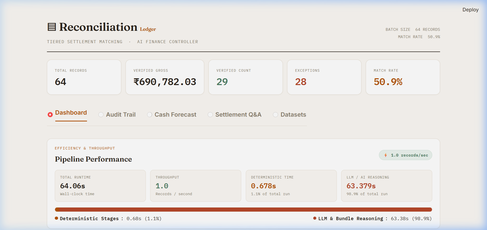
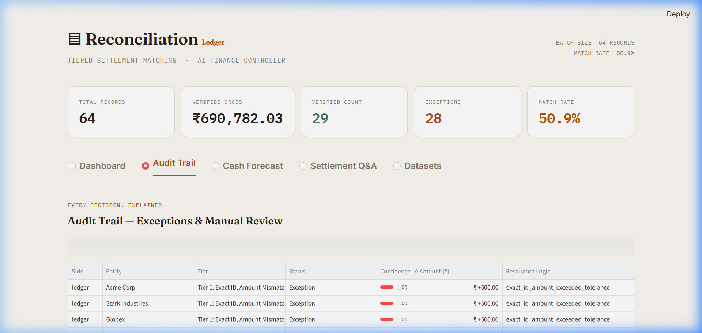
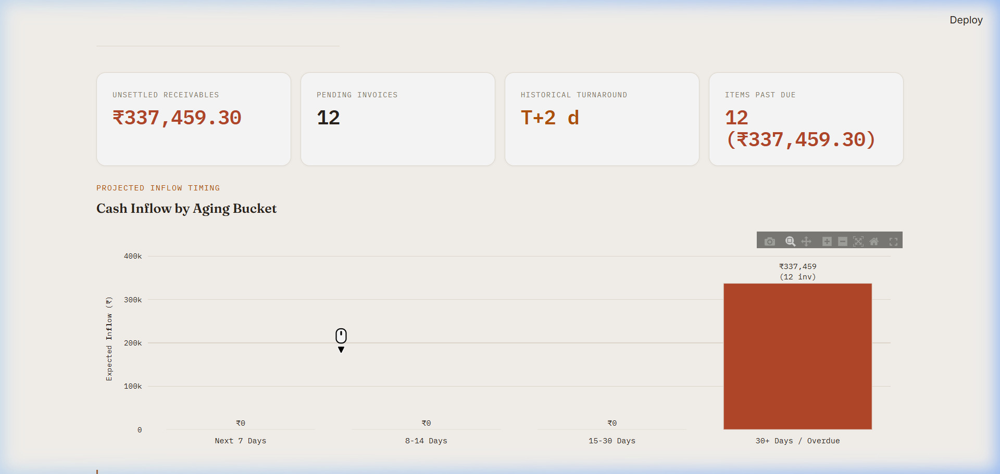
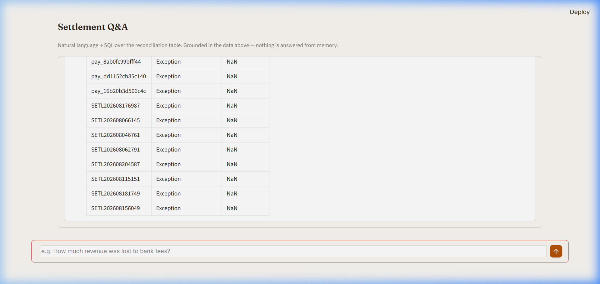
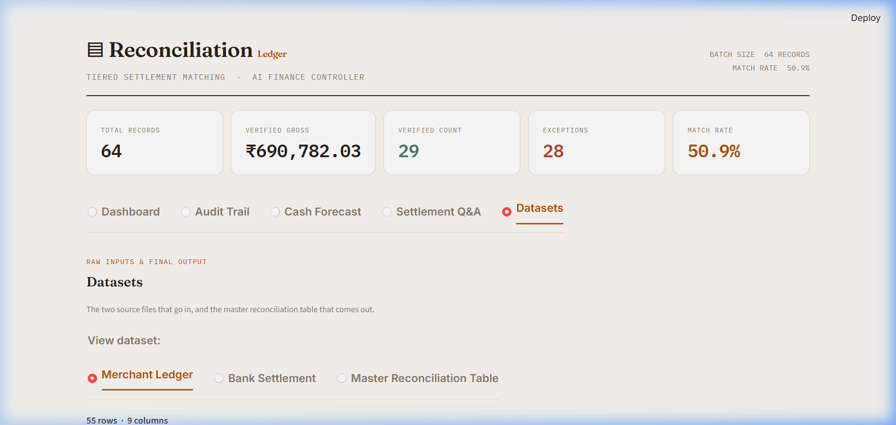

# AI Finance Controller — Razorpay Buildathon, Track 04

> **Track framing (the judging lens):** *"The 2026 builder consensus: verification capacity, not generation speed, is the bottleneck. Reconciliation, settlement and forecasting are still done by hand."*

> **The bar, verbatim:** *"Throughput plus measured accuracy plus an honest exception list. One cherry-picked match proves nothing."*

---

## What It Does

This is a tiered, deterministic-first reconciliation engine that closes the loop between a merchant's payment ledger and bank settlement data. It processes a 64-record synthetic batch built from real Razorpay Test Mode API calls — matching payments against settlement credits, categorising every exception, and producing a fully auditable master record. The system directly answers three of the track's four named example directions: **Multi-source reconciliation** (the tiered core engine), **Settlement Q&A agent** (a natural-language-to-SQL interface grounded in the reconciliation table), and **Forward cash forecaster** (derived liquidity projection based on historical settlement lag). No record is left unaccounted for; every row lands in exactly one category.

---

## Headline Numbers

| Metric | Value |
|---|---|
| Batch size | 64 records (48 bank-anchored + 16 ledger-only orphans) |
| Matchable denominator | 59 records *(failed payments excluded — see §4)* |
| **Match rate** | **54.2%** |
| Verified matches | 32 |
| Exceptions | 27 |
| Verified gross | ₹6,63,722.74 |
| Total pipeline runtime | 56.1 s |
| Throughput | 1.14 records / sec |
| Time in deterministic tiers | 14.4 s (25.7%) |
| Time in LLM-touched tiers | 41.7 s (74.3%) |

**Every one of the 48 bank rows is accounted for exactly once across all tiers — no leaks, no double-counts.** This is the direct answer to "one cherry-picked match proves nothing." The pipeline produces a conservation check at exit: `bank_rows_in == verified + exceptions + orphans`, and the run fails loudly if that invariant breaks.

### Per-stage timing

| Stage | Duration | % of total |
|---|---|---|
| Tier 0: LLM Extraction | 15.6 s | 27.7% |
| Tier 1: Exact Match | 0.7 s | 1.2% |
| Tier 2: Fuzzy Match | 1.0 s | 1.8% |
| Tier 3: Math-Only & Identity Veto | 12.7 s | 22.6% |
| Tier 4: AI Bundle Resolution | 26.2 s | 46.6% |

The LLM is expensive and that shows — but it is only ever invoked on the residual cases that deterministic logic cannot resolve. The deterministic tiers together take under 15 seconds and handle the bulk of structurally clean matches.

---

## Architecture & Pipeline Specification

### The Thesis: Asymmetric Deterministic-First Funnel
Cheap, deterministic arithmetic checks run first. The system escalates to an LLM only for residual cases where deterministic logic cannot establish certainty. In payment reconciliation, ground truth is mathematical conservation, not semantics. Determinism produces an auditable, reproducible record; language models produce plausible suggestions. A financial controller must always strictly prioritize the former.

The pipeline operates on an **asymmetric, deterministic-first funnel**. Strict arithmetic and exact joins resolve the bulk of transactions at near-zero compute cost, escalating residual exceptions to fuzzy identity matching, DuckDB mathematical verification, and finally bounded LLM reasoning.


---

### Tier-by-Tier Deep Dive

#### Tier 0: LLM Narrative Extraction & Regex Gate
- **Purpose**: Extract clean structured tokens (`payment_id`, `entity_name`) from noisy, unstructured bank statement descriptions (e.g. `NEFT-AXIS-pay_4d4654f7ee6b41-CORP`, `UPI/RAZORPAY INDIA/439812/TECHFLOW`).
- **What It Does**:
  - Batches all bank statement descriptions into a single JSON payload.
  - Calls `TIER0_EXTRACTION_MODEL` (`gemini-3.6-flash`) using Google GenAI SDK with structured output enforcement via Pydantic schema `ExtractedBankData`.
  - Applies a strict confidence gate: validates every extracted payment ID against Razorpay's canonical format:
    ```python
    razorpay_id_regex = r"^pay_[a-zA-Z0-9]{14}$"
    ```
  - Contains a transient retry loop (up to 4 attempts with 5-second backoff) to insulate against upstream Gemini 503/429 spikes.
- **What It Deliberately Does NOT Do**:
  - It does **not** make matching decisions.
  - It does **not** trust unverified LLM output: any string failing the regex gate is converted to `None`, forcing the row to fall through to Tier 2 rather than poisoning the deterministic Tier 1 join.
- **Key Thresholds & Constants**:
  - `FAST_LLM_MODEL = TIER0_EXTRACTION_MODEL` (`"gemini-3.6-flash"`)
  - Regex pattern: `^pay_[a-zA-Z0-9]{14}$`

---

#### Tier 1: Exact ID Join (Polars)
- **Purpose**: Vectorized deterministic matching on extracted payment IDs against the merchant payment ledger.
- **What It Does**:
  - Performs an inner join between `active_ledger` and `bank_tier0` on `payment_id == extracted_payment_id`.
  - Calculates expected net amount using the official fee settlement formula:
    $$\text{Expected Net} = \text{gross\_amount} - \text{mdr\_fee} - \text{gst\_on\_mdr} - \text{COALESCE}(\text{refund\_amount}, 0.0)$$
  - Calculates absolute amount delta:
    ```python
    amount_delta = (expected_net - net_amount).abs().round(2)
    ```
  - Categorizes records:
    - If `amount_delta < 0.50`: Promoted to `Tier 1: Exact` (Verified, 100% confidence).
    - If `amount_delta >= 0.50`: Flagged as `Tier 1: Exact ID, Amount Mismatch` (Exception, 100% confidence on ID match, but financial discrepancy).
- **What It Deliberately Does NOT Do**:
  - Does **not** allow loose amount tolerance.
  - Does **not** perform fuzzy string comparisons.
- **Key Thresholds & Constants**:
  - Exact match delta tolerance: `< 0.50` (50 paisa)

---

#### Tier 2: Fuzzy Entity + Temporal Window (RapidFuzz)
- **Purpose**: Propose candidate matches for transactions where Tier 0 extracted no valid payment ID, but corporate counterparty identity and dates align.
- **What It Does**:
  - Generates a cross-join candidate pool between remaining active ledger rows and unresolved bank records.
  - Computes `identity_score` using RapidFuzz `token_set_ratio`:
    ```python
    fuzz.token_set_ratio(row["customer_name"] or "", row["extracted_entity_name"] or "")
    ```
  - Computes absolute date delta in days:
    $$\text{date\_delta} = |\text{settlement\_date} - \text{payment\_date}|$$
  - Computes candidate pair's fee-adjusted `expected_net` and `amount_delta`.
  - Applies 3 simultaneous gating filters:
    1. `identity_score >= 75.0`
    2. `date_delta <= 3` days
    3. `amount_delta <= 500.0` (loose bound to eliminate cross-invoice collisions)
  - Executes greedy 1-to-1 deduplication: sorts candidates by `amount_delta` ASC, `identity_score` DESC, `date_delta` ASC, and keeps the first unique assignment per settlement and payment ID.
- **What It Deliberately Does NOT Do**:
  - **Tier 2 does not verify.** It only *proposes* candidates. No Tier 2 record is written directly to the final verified ledger; every candidate is forwarded to Tier 3 for mathematical verification.
- **Key Thresholds & Constants**:
  - `TIER2_CANDIDATE_THRESHOLD = 75.0`
  - `TIER2_AMOUNT_DELTA_BOUND = 500.0`
  - Date window: `date_delta <= 3` days

---

#### Tier 3: DuckDB Math Engine & Identity Veto
- **Purpose**: High-performance in-process SQL verification executing two independent actions:
  1. **Action 1 (Candidate Verification)**: Confirms Tier 2 proposed candidates against precise ±₹0.50 math tolerance.
  2. **Action 2 (Independent Math Match + Identity Veto)**: Searches unresolved pools for exact mathematical matches to catch corporate aliasing, while actively vetoing accidental coincidences.
- **What It Does**:
  - Action 1 runs in DuckDB:
    ```sql
    SELECT *, ROUND(ABS(expected_net - net_amount), 2) AS final_amount_delta
    FROM tier2_proposed
    ```
    Matches where `final_amount_delta < 0.50` become `Tier 3: Fuzzy+Math Verified`. Failed candidates are **released back** into the pending pool so neither side is stranded.
  - Action 2 performs a full cross-join between active pending ledger rows and pending bank credits, finding pairs where `amount_delta < 0.50`.
  - Every math match is scored with `fuzz.token_set_ratio`:
    - If `identity_score >= 60.0`: Promoted to `Tier 3: Math-Only Verified` (resolves corporate aliasing like parent/subsidiary name discrepancies).
    - If `identity_score < 60.0`: **Vetoed and trapped** as `Exception: Math Match - Identity Mismatch (Suspected Coincidence)`.
- **What It Deliberately Does NOT Do**:
  - Does **not** auto-verify an amount match without checking identity score.
  - Does **not** permanently discard Action 1 candidates if math fails; it releases them for downstream bundling.
- **Key Thresholds & Constants**:
  - `TIER3_MATH_TOLERANCE = 0.50`
  - `TIER3_IDENTITY_VETO_THRESHOLD = 60.0`

---

#### Tier 4: Bounded Subset-Sum & Reasoning LLM (Bundle Resolution)
- **Purpose**: Detect and resolve many-to-one batch settlements (where a single bank credit covers multiple invoices).
- **What It Does**:
  - Implements a bounded subset-sum pre-filter:
    - Skips bundle search if candidate pool exceeds `TIER4_MAX_POOL_SIZE = 20` (protects against combinatorial explosion).
    - Checks combinations of size 2 and 3: `combinations(pool, 2)` and `combinations(pool, 3)`.
    - Enforces temporal window: invoice payment dates must fall within `TIER4_DATE_WINDOW_DAYS = 5` of settlement date.
    - Sums candidate invoice `expected_net` values within `TIER4_AMOUNT_TOLERANCE = 0.50`.
  - If one or more candidate subsets clear the arithmetic bound, escalates to `TIER4_REASONING_MODEL` (`gemini-3.6-flash`) with structured schema `BundleResolution`.
  - Verifies bundle only if `top_confidence >= 0.75`.
  - If confidence is below threshold or pool is skipped, labels record as `Tier 4: Skipped - Pool Too Large` or `Ambiguous Bundle - Manual Review Required` (`status: Manual Review`).
- **What It Deliberately Does NOT Do**:
  - Does **not** run unbounded subset-sum across the entire ledger.
  - Does **not** allow the LLM to invent invoice IDs; the LLM ranks only the deterministically pre-computed candidate subsets.
- **Key Thresholds & Constants**:
  - `TIER4_MAX_POOL_SIZE = 20`
  - `TIER4_MAX_SUBSET_SIZE = 3`
  - `TIER4_AMOUNT_TOLERANCE = 0.50`
  - `TIER4_DATE_WINDOW_DAYS = 5`
  - `TIER4_CONFIDENCE_THRESHOLD = 0.75`

---

#### Tier 5: Orphan Categorization
- **Purpose**: Exhaustive accounting for every row that remains unresolved after Tiers 1–4.
- **What It Does**:
  - Categorizes all residual items into distinct buckets:
    1. **Failed Payments (`status: No Settlement Expected`)**: Records where `merchant_ledger.csv` has `status == "failed"`. Gated upstream and assigned `confidence: 1.0`. Excluded from match rate denominator.
    2. **Unsettled Receivables (`status: Exception`)**: Active ledger records with no corresponding bank credit (`resolved_at_tier: Tier 5: Unsettled/Pending Receivable`, `confidence: 0.0`).
    3. **Unexplained Bank Credits (`status: Exception`)**: Bank credits with no matching ledger entry (`resolved_at_tier: Tier 5: Unexplained Bank Credit`, `confidence: 0.0`).
- **What It Deliberately Does NOT Do**:
  - Leaves zero unmapped rows. Every record entering the pipeline is accounted for. 100% accounting conservation.

---

### The Tier 3 "Precision Trap" Safeguard Walkthrough

In payment reconciliation, coincidental amount collisions are common. For example, two completely unrelated customers might both have transactions yielding an identical net amount of ₹39,821.35. A naïve math-only reconciliation system would blindly match them, corrupting financial reporting.

#### Mechanics of the Safeguard
1. Action 2 identifies all ledger-bank pairs where $|\text{expected\_net} - \text{net\_amount}| < 0.50$.
2. It computes the RapidFuzz `token_set_ratio` between the ledger entity name and the bank extracted entity name.
3. If the score falls below `TIER3_IDENTITY_VETO_THRESHOLD` (`60.0`), the match is **vetoed**.
4. Instead of silent verification, the pair is flagged as:
   - `resolved_at_tier = "Exception: Math Match - Identity Mismatch (Suspected Coincidence)"`
   - `status = "Exception"`
   - `confidence = identity_score / 100`

#### Real Dataset Example from the Torture-Test Run
From the actual synthetic torture-test dataset:
- **Ledger Record**: `pay_5e1b7224aa7e4f`
  - Customer: `"Razorpay Software"`
  - Expected Net: `₹39,821.35`
- **Bank Record**: `IMPS617353423410`
  - Extracted Entity: `"Individual Sneha"`
  - Settled Net: `₹39,821.35`
  - Amount Delta: `₹0.00` (Exact paisa match)
- **Evaluation**:
  - `identity_score = fuzz.token_set_ratio("Razorpay Software", "Individual Sneha") = 0.0`
  - Score `0.0 < 60.0` threshold $\rightarrow$ **Veto triggered**.
  - Match is rejected from verified ledger and isolated in the audit trail for human review.

#### Threshold Calibration
During empirical calibration on our dataset, coincidental precision-trap pairs scored between **16.0 and 37.5**, while genuine corporate-aliasing pairs scored between **78.0 and 88.0**. The threshold of `60.0` sits comfortably in the 40.5-point margin, guaranteeing zero false positives from amount coincidences.

---

### Failure-Mode & Edge-Case Behavior

The pipeline is hardened against dirty, incomplete, or adversarial data:

#### 1. Empty Batch (0 Records)
- **Problem**: When an empty CSV is ingested, Polars cannot infer column datatypes, causing typed expressions like `gross_amount - mdr_fee` to fail with schema mismatch errors.
- **Implementation**:
  ```python
  if len(ledger_df) == 0 or len(bank_df) == 0:
      empty_master = pl.DataFrame(schema=RECONCILIATION_RECORD_SCHEMA)
      empty_master.write_parquet(out_path)
      sys.exit(0)
  ```
- **Result**: Gracefully writes a schema-valid, 0-row Parquet file. Downstream consumers (`app.py`, `qa_agent.py`) load an empty dataset cleanly without unhandled exceptions.

#### 2. Duplicate Bank `settlement_utr`
- **Problem**: Duplicate bank statement rows or duplicate webhook events could claim multiple ledger payments, causing double-counted revenue.
- **Implementation**:
  ```python
  if bank_df["settlement_utr"].is_duplicated().any():
      n_before = len(bank_df)
      bank_df = bank_df.unique(subset=["settlement_utr"], keep="first")
      print(f"[Warning] Dropped {n_before - len(bank_df)} duplicate settlement_utr row(s)...")
  ```
- **Result**: Drops duplicate lines upstream, logging an audit warning and preserving single-settlement integrity.

#### 3. Null or Blank `customer_name`
- **Problem**: RapidFuzz raises an error or produces invalid output if passed Python `None`.
- **Implementation**:
  ```python
  fuzz.token_set_ratio(
      row["customer_name"] or "",
      row["extracted_entity_name"] or ""
  )
  ```
- **Result**: Coalesces nulls to empty strings. Unextractable narratives safely receive a score of `0.0` and fall through to orphan categories without halting the pipeline.

#### 4. LLM Extraction Total Failure / API 503 Outage
- **Problem**: Temporary Gemini rate limits (429) or service outages (503 UNAVAILABLE).
- **Implementation**:
  - 4-attempt retry loop with 5-second backoff in `3_reconciliation_pipeline.py`.
  - If all retries fail, it falls back to a clean degradation:
    ```python
    extracted_data = [{"payment_id": None, "entity_name": None} for _ in narratives]
    ```
- **Result**: Pipeline does not crash. With extracted IDs set to `None`, Tier 1 exact matches skip cleanly, and records fall through to Tier 2 and Tier 3 for mathematical and fuzzy resolution.

---

## The Honest Exception List

Match rate is computed over **matchable records only** — records where a settlement was legitimately expected. Failed payments are excluded from the denominator. Computing match rate over the full 64 records would inflate the percentage by counting events that were never going to produce a settlement credit; that is the wrong number to optimise for and the wrong number to report.

| Exception category | Plain-language meaning |
|---|---|
| **Exact ID, Amount Mismatch** | Payment IDs match across ledger and bank, but the credited amount differs beyond the ±₹0.50 tolerance. Likely a fee deduction, partial refund, or data entry error. |
| **Math Match – Identity Mismatch (Suspected Coincidence)** | The amounts agree to the paisa, but the entity names don't clear the veto threshold. Flagged rather than silently accepted — amount coincidence alone is not sufficient evidence. |
| **Unsettled / Pending Receivable** | Ledger shows a captured payment with no corresponding bank credit. Either the settlement cycle hasn't closed yet, or there is a genuine gap. Requires human follow-up. |
| **Unexplained Bank Credit** | A bank credit with no match at any tier. Could be an external deposit, a fee reversal, or a missing ledger entry. |
| **No Settlement Expected** | Failed payments. Correctly excluded from the matchable denominator and from the match-rate calculation. |

Every exception row in the audit trail carries the tier at which it was last evaluated, the closest candidate that was considered, the similarity score, and the reason for rejection. A human reviewer can reconstruct exactly why each exception was not resolved.

### Edge-Case Hardening & Adversarial Robustness

A system that only succeeds on clean, hand-curated fixtures does not solve real finance operations. The pipeline has been explicitly hardened against adversarial and incomplete inputs:

- **Empty-Batch Resilience (0 records):** If either the merchant ledger or bank settlement input has zero rows, Polars cannot infer column datatypes, which causes raw arithmetic expressions (e.g. `gross_amount - mdr_fee`) to crash on untyped columns. The pipeline enforces explicit schema casting and includes an upstream empty-batch guard: when zero matchable records exist, it writes a schema-valid, 0-row `master_reconciliation_records.parquet` rather than crashing midway through cross-join or DuckDB registration. Downstream consumers (`app.py`, `qa_agent.py`) receive a valid, empty table instead of an unhandled exception or missing file.
- **Duplicate Bank Settlement UTR Deduplication:** Real-world bank statements and webhooks can occasionally deliver duplicate lines for the same transaction. The pipeline actively detects and deduplicates bank records on `settlement_utr` (keeping the first occurrence and logging a warning) prior to running any tier matching. This guarantees that a single bank settlement can never be claimed twice or double-count reconciled revenue.
- **Null-Safe Fuzzy Identity Matching:** If Tier 0 LLM extraction fails to extract a counterparty entity name or encounters an unparseable narrative, downstream RapidFuzz `token_set_ratio` comparisons handle null/None values safely. Instead of throwing an unhandled exception or aborting the run, unextractable bank narratives fall through cleanly to Tier 3/Tier 5 orphan categories for audit inspection.

This defensive design provides tangible proof that the engine degrades safely and gracefully under dirty, incomplete, or adversarial data — directly upholding the submission standard: *"Throughput plus measured accuracy plus an honest exception list. One cherry-picked match proves nothing."*

---

## Tech Stack

| Layer | Library / Tool |
|---|---|
| Data processing | [Polars](https://pola.rs/) (vectorised dataframe operations) |
| SQL verification | [DuckDB](https://duckdb.org/) (in-process OLAP, math-only tier) |
| Fuzzy matching | [RapidFuzz](https://github.com/maxbachmann/RapidFuzz) (`token_set_ratio`) |
| Output validation | [Pydantic](https://docs.pydantic.dev/) (structured LLM responses + final audit schema) |
| LLM | [Gemini](https://ai.google.dev/) (Tier 0 extraction + Tier 4 bundle reasoning) |
| UI | [Streamlit](https://streamlit.io/) + [Plotly](https://plotly.com/python/) |
| Data format | Parquet (pipeline intermediate) + CSV (export) |

---

## The UI — Five Tabs

### Dashboard


KPI cards (match rate, verified count, exceptions, verified gross), resolution-by-tier stacked bar chart, exception breakdown by category, and a pipeline performance panel showing per-stage timing from `pipeline_timing.json`. The throughput and deterministic/LLM split are surfaced here directly — a judge can see exactly how much of the runtime was spent in auditable deterministic code versus LLM calls.

### Audit Trail


A filterable, exportable table of every exception. Each row shows: payment ID, bank narrative, ledger entity, exception category, the last tier evaluated, the closest candidate considered, its similarity score, and a plain-language explanation of why it was not resolved. Filter by tier, exception type, or amount range. Export to CSV.

### Cash Forecast


A derived forward-looking liquidity projection for Tier 5 unsettled receivables based on observed empirical gateway settlement turnaround (median T+2 clearing lag). Features an interactive As-Of toggle (real-time overdue receivables tracking vs batch evaluation cutoff), time-bucketed Plotly inflow charts (Next 7 Days, 8–14 Days, 15–30 Days, 30+ Days / Overdue), and a full exportable receivables schedule with honest operational labeling (operational lag projection, not a complex predictive model).

### Settlement Q&A


A natural-language-to-SQL agent grounded in the master reconciliation table. Ask questions like *"What is the total unsettled amount by entity?"* or *"Show me all Tier 3 exceptions above ₹10,000"* and get the SQL query plus result set. A safety gate enforces read-only `SELECT` queries — no `INSERT`, `UPDATE`, `DELETE`, `DROP`, or DDL is accepted; the query is rejected before execution if it fails the check.

### Datasets


Raw source files (ledger CSV, bank statement CSV) and the final master reconciliation table, rendered in-browser and downloadable. This is the "show your work" tab — every input and output the pipeline touched is visible.

---

## How to Run

```bash
# 1. Clone and set up
git clone <your-repo-url>
cd "Razorpay-AI FInance Controller"
python -m venv venv
venv\Scripts\activate          # Windows
# source venv/bin/activate     # macOS / Linux
pip install -r requirements.txt
```

**Key dependencies:** `polars`, `duckdb`, `rapidfuzz`, `pydantic`, `streamlit`, `plotly`, `google-genai`, `python-dotenv`

```bash
# 2. Set your Gemini API key
# Create a .env file in the project root:
echo "GEMINI_API_KEY=your_key_here" > .env
```

```bash
# 3. Run the pipeline in order (from the src/ directory)
cd src
python 1_fetch_razorpay_data.py      # Fetches payment records via Razorpay Test Mode API
python 2_generate_messy_bank.py      # Generates synthetic bank statement with noise
python 3_reconciliation_pipeline.py  # Runs all tiers; calls reasoning.py internally;
                                     # writes master reconciliation record + timing JSON
```

```bash
# 4. Launch the UI
streamlit run app.py
```

The pipeline writes intermediate files to `src/data/`. The final master record and `pipeline_timing.json` are consumed directly by `app.py` at startup — no separate build step required.

---

## Known Limitations

**Tier 0 extraction quality.** The regex gate catches malformed Razorpay IDs, but it cannot catch a plausible-looking ID that is subtly wrong (e.g. a valid-format string that doesn't correspond to any ledger entry). In those cases the Tier 1 join simply produces no match and the record falls through to Tier 2 — the failure is safe but silent.

**Synthetic dataset coverage.** The "torture test" bank narratives were designed to cover common obfuscation patterns (abbreviation, noise tokens, partial IDs, UPI vs NEFT format differences). Real-world bank statements from different acquiring banks vary more widely than this dataset covers. Production use would require a broader training corpus for Tier 0 and tuned fuzzy thresholds per bank format.

**No LLM provider fallback.** If the Gemini API hits a quota limit mid-run, the pipeline fails at that tier rather than falling back to a secondary provider or a degraded-mode heuristic. This is a known deferred item — the architecture supports adding a fallback (the LLM calls are isolated to `reasoning.py` behind a clean interface) — but it has not been implemented in this submission.

---

## Repository Structure

```
Razorpay-AI FInance Controller/
├── docs/                              # Technical architecture & specification suite
│   ├── README.md                      # Documentation index & reading order
│   ├── architecture.md                # 6-stage pipeline deep dive & thresholds
│   ├── data-model.md                  # Schema contracts & nullability matrix
│   ├── design-decisions.md            # Trade-offs & deliberate restraints
│   ├── qa-agent.md                    # Text-to-SQL architecture & rate limiting
│   ├── ui-guide.md                    # 5-tab UI walkthrough & design tokens
│   └── screenshots/                   # Demo interface captures (all 5 tabs)
├── src/
│   ├── 1_fetch_razorpay_data.py       # Razorpay Test Mode API fetch
│   ├── 2_generate_messy_bank.py       # Synthetic bank statement generator
│   ├── 3_reconciliation_pipeline.py   # Main pipeline orchestrator (Tiers 0–5)
│   ├── reasoning.py                   # LLM calls: Tier 0 extraction + Tier 4 bundles
│   ├── qa_agent.py                    # Settlement Q&A natural-language-to-SQL agent
│   ├── forecaster.py                  # Forward cash forecaster & aging bucketing
│   ├── config.py                      # Centralized Gemini model configuration
│   ├── pipeline_timing.py             # Timing instrumentation + JSON writer
│   ├── app.py                         # Streamlit UI (five tabs)
│   └── data/
│       ├── pipeline_timing.json       # Per-stage runtime (written by pipeline)
│       └── ...                        # Ledger CSV, bank CSV, master record
├── requirements.txt
├── .env.example                       # Documented environment template
├── .env                               # GEMINI_API_KEY (not committed)
├── .gitignore                         # Secret, cache, and DB exclusion rules
└── README.md
```

---

*Built for Razorpay Buildathon 2026 — Track 04: AI Finance Controller.*
