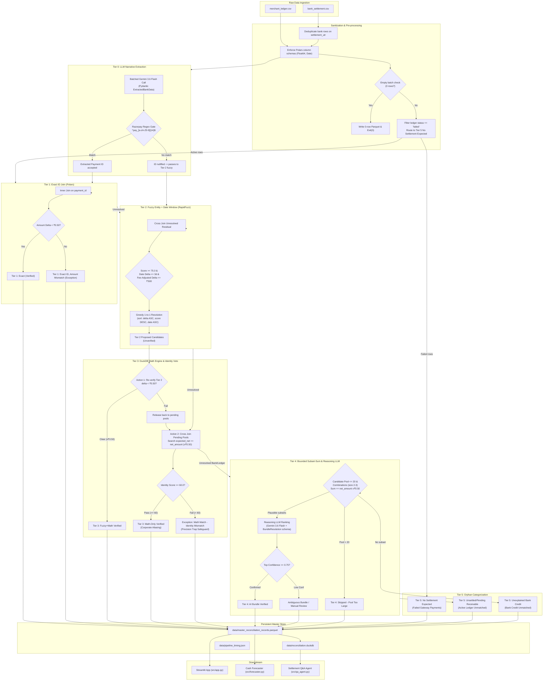

# AI Finance Controller — Razorpay Buildathon, Track 04

> *"The 2026 builder consensus: verification capacity, not generation speed, is the bottleneck. Reconciliation, settlement and forecasting are still done by hand."*
>
> *"Throughput plus measured accuracy plus an honest exception list. One cherry-picked match proves nothing."*

**[▶ Find the demo of the project](https://drive.google.com/file/d/1G48viY3KmxUUJzZgh69988a7MQfnAoIz/view?usp=sharing)** · [📚 Full Technical Docs](docs/README.md) · [🏗️ Architecture](docs/architecture.md)

---

## What It Does

A **tiered, deterministic-first reconciliation engine** that closes the loop between a merchant's payment ledger and bank settlement data — matching payments, categorising every exception, and producing a fully auditable master record. No record is left unaccounted for.

Covers three of the track's four named directions:

| Direction | Implementation |
|---|---|
| Multi-source reconciliation | 6-tier pipeline (Tiers 0–5) |
| Settlement Q&A agent | Natural-language → SQL, grounded in the master record |
| Forward cash forecaster | Liquidity projection from historical gateway lag |

---

## Results at a Glance

| Metric | Value |
|---|---|
| Batch size | 64 records |
| Matchable records | 57 *(7 failed payments excluded)* |
| ✅ **Match rate** | **50.9%** |
| Verified matches | 29 |
| Exceptions flagged | 28 |
| Verified gross processed | ₹6,90,782.03 |
| Total pipeline runtime | 59.0 s |
| Throughput | 1.09 records / sec |
| Deterministic tier time | 2.8 s (4.8%) |
| LLM tier time | 56.1 s (95.2%) |

**Every one of the 48 bank rows lands in exactly one bucket — no leaks, no double-counts.** The pipeline enforces a hard conservation invariant at exit: `bank_rows_in == verified + exceptions + orphans`.

<details>
<summary>Per-stage timing breakdown</summary>

| Stage | Duration | % of total |
|---|---|---|
| Tier 0: LLM Extraction | 21.3 s | 36.2% |
| Tier 1: Exact Match | 0.02 s | 0.0% |
| Tier 2: Fuzzy Match | 0.05 s | 0.1% |
| Tier 3: Math-Only & Identity Veto | 2.75 s | 4.7% |
| Tier 4: AI Bundle Resolution | 34.8 s | 59.1% |

Tiers 1–3 finish in under 3 seconds. The LLM is only called on cases deterministic logic cannot resolve.

</details>

---

## Screenshots

| Dashboard | Audit Trail |
|---|---|
|  |  |

| Settlement Q&A | Cash Forecast |
|---|---|
|  |  |

---

## Tech Stack

### 🤖 AI / LLM

| Component | Tool | Role |
|---|---|---|
| Tier 0 extraction | `gemini-3.6-flash` | Parse noisy bank narratives → structured `payment_id` + entity |
| Tier 4 bundle ranking | `gemini-3.6-flash` | Rank pre-filtered invoice subsets (structured `BundleResolution` schema) |
| Settlement Q&A | `gemini-3.5-flash` | Natural language → read-only SQL |
| Schema enforcement | **Pydantic v2** | Structured output validation for all LLM responses |

### ⚙️ Data Pipeline

| Component | Tool | Role |
|---|---|---|
| Dataframe ops | **Polars** | Vectorised ingestion, joins, schema casting |
| SQL verification | **DuckDB** (in-process) | Math-only Tier 3 cross-joins, ±₹0.50 tolerance checks |
| Fuzzy matching | **RapidFuzz** `token_set_ratio` | Tier 2 entity identity scoring + Tier 3 veto gate |
| Data format | **Parquet** + **DuckDB** | Intermediate store + queryable audit database |
| API client | **google-genai** 2.x | Gemini SDK with structured output mode |
| Env config | **python-dotenv** | `GEMINI_API_KEY` + optional Razorpay keys |

### 🖥️ UI & Visualisation

| Component | Tool | Role |
|---|---|---|
| Dashboard | **Streamlit** | 5-tab app — Dashboard, Audit Trail, Q&A, Forecast, Datasets |
| Charts | **Plotly** | KPI bars, tier breakdown, cash forecast aging buckets |
| Fonts | Google Fonts (Fraunces, Inter, IBM Plex Mono) | Typography system |

### 📦 Full `requirements.txt` packages

`polars` · `duckdb` · `rapidfuzz` · `pydantic` · `streamlit` · `plotly` · `google-genai` · `python-dotenv` · `requests` · `pyarrow`

---

## Architecture

> Full tier-by-tier breakdown, exact numeric thresholds, Precision Trap walkthrough, and failure-mode behavior: **[docs/architecture.md](docs/architecture.md)**

<details>
<summary><strong>The pipeline in one diagram (click to expand)</strong></summary>

**Thesis:** Cheap deterministic arithmetic runs first. The LLM is only invoked on the residual cases where math cannot establish certainty.



</details>

### Tier summary

| Tier | Method | Key threshold |
|---|---|---|
| **0** — LLM Extraction | Gemini batch call → Pydantic → regex gate | `^pay_[a-zA-Z0-9]{14}$` |
| **1** — Exact ID Join | Polars inner join | Amount delta `< ₹0.50` |
| **2** — Fuzzy Entity | RapidFuzz `token_set_ratio` + date window | Score `≥ 75.0`, date `≤ 3d` |
| **3** — DuckDB Math + Veto | In-process SQL cross-join + identity check | Math `< ₹0.50`, identity `≥ 60.0` |
| **4** — Bundle Resolution | Bounded subset-sum + Gemini reasoning LLM | Pool `≤ 20`, confidence `≥ 0.75` |
| **5** — Orphan Categorisation | Exhaustive residual bucketing | Zero unmapped rows |

---

## Exception Categories

| Category | Meaning |
|---|---|
| **Exact ID, Amount Mismatch** | ID matches but net differs `> ₹0.50` — fee deduction, refund, or data error |
| **Math Match – Identity Mismatch** | Amounts agree to the paisa but entity names fail the veto — suspected coincidence |
| **Unsettled / Pending Receivable** | Active ledger payment with no bank counterpart yet |
| **Unexplained Bank Credit** | Bank credit with no ledger match at any tier |
| **No Settlement Expected** | Failed gateway payments — excluded from match rate denominator |

Match rate is computed over **matchable records only** (57 of 64). Excluded failed payments would inflate the number without reflecting real reconciliation capability.

---

## Project Status

### ✅ Completed
- Full Tiers 0–5 pipeline with conservation invariant enforcement
- Master `ReconciliationRecord` schema (Parquet + DuckDB, full audit trail)
- Streamlit dashboard — 5 tabs with KPIs, audit trail, Q&A, forecast, raw datasets
- Edge-case hardening — empty batch, duplicate UTR, null-safe fuzzy, LLM retry/fallback

### ⚠️ Deliberately Deferred
- **No LLM provider fallback** — quota exhaustion mid-run fails that tier; LLM calls are isolated in `reasoning.py` to make a fallback straightforward to add
- **Cash forecaster = historical median lag** — T+2 gateway cycle estimate, not a time-series model; the UI labels this explicitly

---

## Quick Start (No Pipeline Run Needed)

A pre-computed `master_reconciliation_records.parquet` is committed under `data/sample_output/`. Launch the dashboard immediately without a Gemini API key:

```bash
git clone <your-repo-url>
cd "Razorpay-AI FInance Controller"
python -m venv venv && venv\Scripts\activate   # Windows
pip install -r requirements.txt
cd src && streamlit run app.py
```

---

## Full Pipeline Run

```bash
# 1. Configure environment
cp .env.example .env          # then set GEMINI_API_KEY inside

# 2. Run pipeline steps in order (from src/)
cd src
python 1_fetch_razorpay_data.py       # Razorpay Test Mode API fetch
python 2_generate_messy_bank.py       # Synthetic noisy bank statement
python 3_reconciliation_pipeline.py   # All tiers → master record + timing JSON

# 3. Launch UI
streamlit run app.py
```

Output is written to `src/data/` and loaded by `app.py` at startup.

---

## Repository Structure

```
Razorpay-AI FInance Controller/
├── docs/
│   ├── README.md                  # Docs index & reading order
│   ├── architecture.md            # Pipeline deep dive & thresholds
│   ├── data-model.md              # Schema contracts & nullability
│   ├── design-decisions.md        # Trade-off rationale
│   ├── qa-agent.md                # Text-to-SQL architecture
│   ├── ui-guide.md                # UI walkthrough & design tokens
│   └── screenshots/               # Demo captures (all 5 tabs)
├── src/
│   ├── 1_fetch_razorpay_data.py   # Pipeline step 1
│   ├── 2_generate_messy_bank.py   # Pipeline step 2
│   ├── 3_reconciliation_pipeline.py  # Pipeline step 3 (main)
│   ├── reasoning.py               # LLM calls (Tier 0 + Tier 4)
│   ├── qa_agent.py                # NL-to-SQL agent
│   ├── forecaster.py              # Cash forecast & aging buckets
│   ├── config.py                  # Centralized model constants
│   ├── pipeline_timing.py         # Timing instrumentation
│   ├── app.py                     # Streamlit entry point
│   └── data/                      # Runtime output (gitignored)
├── data/
│   └── sample_output/
│       └── master_reconciliation_records.parquet  # Pre-computed demo output
├── requirements.txt
├── .env.example                   # Environment template (copy to .env)
├── .gitignore
├── LICENSE                        # MIT
└── README.md
```

---

## License

**MIT License** — see [`LICENSE`](LICENSE) for the full text.

---

*Built for Razorpay Buildathon 2026 — Track 04: AI Finance Controller.*
