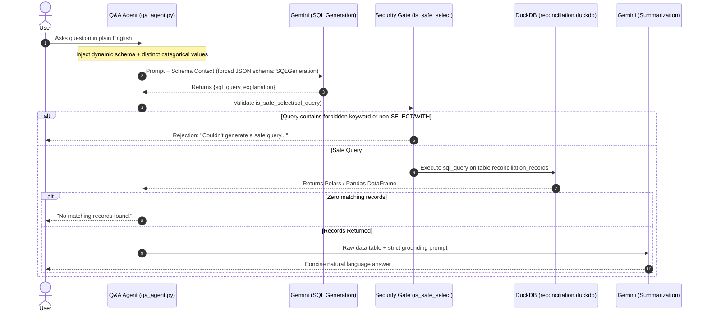

# Settlement Q&A Agent Specification

This document details the architecture, security gates, and rate-limiting mechanics of the natural-language-to-SQL agent implemented in `src/qa_agent.py`.

---

## 1. Text-to-SQL Architecture

The Q&A agent provides a conversational interface over the reconciled batch without allowing model hallucinations. Every natural language response is strictly grounded in real query results executed against DuckDB.



---

## 2. Dynamic Schema Context Injection

To eliminate hallucinated column names and fabricated status strings, `src/qa_agent.py` dynamically introspects the DuckDB table at startup and embeds valid categorical domains directly into the system prompt:

```python
schema_info = con.execute("DESCRIBE reconciliation_records").pl()
distinct_status = con.execute("SELECT DISTINCT status FROM reconciliation_records").pl()["status"].to_list()
distinct_tiers = con.execute("SELECT DISTINCT resolved_at_tier FROM reconciliation_records").pl()["resolved_at_tier"].to_list()
```

### Schema Prompt Context Provided to the Model
The generated prompt provides the LLM with:
1. Exact column names and SQL types (`record_id`, `gross_amount`, `amount_delta`, etc.).
2. Closed-world domain of valid `status` strings:
   `['Verified', 'Exception', 'Manual Review', 'No Settlement Expected']`
3. Closed-world domain of valid `resolved_at_tier` strings.
4. **Domain-Specific Guidance**:
   - For ledger-only rows (`Tier 5: Unsettled/Pending Receivable`), `net_amount` is `NULL` because no bank settlement occurred $\rightarrow$ use `gross_amount`.
   - For bank-only rows (`Tier 5: Unexplained Bank Credit`), `gross_amount` is `NULL` because no ledger entry exists $\rightarrow$ use `net_amount`.

---

## 3. Read-Only Safety Gating

Before any generated SQL is executed against DuckDB, it must clear the AST/keyword safety gate:

```python
FORBIDDEN_KEYWORDS = [
    "UPDATE", "DELETE", "INSERT", "DROP", "ALTER", "CREATE",
    "TRUNCATE", "ATTACH", "COPY", "EXPORT", "PRAGMA"
]

def is_safe_select(sql: str) -> bool:
    normalized = sql.strip().upper()
    if not normalized.startswith("SELECT") and not normalized.startswith("WITH"):
        return False
    return not any(kw in normalized for kw in FORBIDDEN_KEYWORDS)
```

- **Prefix Enforcement**: Only queries starting with `SELECT` or `WITH` are allowed.
- **Blocklist**: Any query containing DDL, DML, or administrative commands (`PRAGMA`, `ATTACH`, `COPY`) is rejected immediately prior to execution.

---

## 4. Two-Stage Generation Pipeline

1. **Stage 1: Structured SQL Generation**:
   Enforces a strict Pydantic JSON schema (`SQLGeneration`):
   ```python
   class SQLGeneration(BaseModel):
       sql_query: str
       explanation: str
   ```
   The model is strictly instructed to produce valid DuckDB-compliant SQL and nothing else.
2. **Stage 2: Grounded Natural-Language Summarization**:
   The SQL query is executed directly against DuckDB. The resulting table is formatted as plain text and passed to a secondary generation call:
   ```python
   summary_prompt = f"""The user asked: "{question}"
   The query result (as data) is:
   {result.to_pandas().to_string(index=False)}

   Give a brief, direct natural-language answer to their question based ONLY on this data.
   Do not add any information not present in the result."""
   ```
   If the summarization call times out or fails, the raw tabular result is returned to the user as a fallback.

---

## 5. Dual-Layer Rate Limiting

The Q&A agent implements a dual-layer strategy to survive strict free-tier and shared API quotas:

### 1. Proactive Throttle (Sliding Window Token Bucket)
Tracks request timestamps inside a rolling deque to enforce a hard ceiling of 5 calls per minute:
```python
_request_times = deque(maxlen=5)
RATE_LIMIT_PER_MINUTE = 5
RATE_LIMIT_WINDOW = 60  # seconds

def throttle():
    now = time.time()
    if len(_request_times) == _request_times.maxlen:
        oldest = _request_times[0]
        elapsed = now - oldest
        if elapsed < RATE_LIMIT_WINDOW:
            wait = RATE_LIMIT_WINDOW - elapsed + 1
            print(f"Proactively pacing: waiting {wait:.1f}s...")
            time.sleep(wait)
    _request_times.append(time.time())
```

### 2. Reactive Retry with Backoff
Wraps every API call in a 5-attempt retry loop with a 15-second base delay when encountering HTTP 429 (`RESOURCE_EXHAUSTED`):
```python
def call_with_retry(fn, max_retries=5, base_delay=15):
    for attempt in range(max_retries):
        throttle()  # Proactive pacing executed before every attempt
        try:
            return fn()
        except Exception as e:
            if "429" in str(e) or "RESOURCE_EXHAUSTED" in str(e):
                if attempt < max_retries - 1:
                    time.sleep(base_delay)
                    continue
            raise
```

---

## 6. Model Configuration & Known Limitations

### Config Centralization (`src/config.py`)
Model identifiers are centralized into named constants:
- `TIER0_EXTRACTION_MODEL = "gemini-3.6-flash"` — Narrative entity and payment ID extraction.
- `TIER4_REASONING_MODEL = "gemini-3.6-flash"` — Bounded subset-sum bundle ranking.
- `QA_AGENT_MODEL = "gemini-3.5-flash"` — Natural language to SQL generation and summarization.

**Deliberate Heterogeneity**:
These models are intentionally allowed to differ. The Q&A agent runs on `gemini-3.5-flash` for lower query latency and separate quota isolation, whereas the pipeline uses `gemini-3.6-flash` for complex JSON schema extraction and multi-invoice bundle reasoning.

### Known Limitations
- **No Multi-Provider Fallback**: If the Google GenAI API quota is completely exhausted across all retries, the agent raises a user-friendly error rather than falling back to an alternative provider (e.g. Anthropic Claude or OpenAI).
