# Streamlit UI & Design System Guide

This document covers the frontend architecture, visual design system, CSS isolation strategy, and component hierarchy of `src/app.py`.

---

## 1. Tab-by-Tab Walkthrough

The interface is structured into five cohesive tabs rendered through an interactive pill navigation bar.

```mermaid
graph TD
    APP["Streamlit Application (src/app.py)"]
    APP --> T1["1. Dashboard"]
    APP --> T2["2. Audit Trail"]
    APP --> T3["3. Cash Forecast"]
    APP --> T4["4. Settlement Q&A"]
    APP --> T5["5. Datasets"]

    T1 --> D1["KPI Masthead & Metrics (master_df)"]
    T1 --> D2["Pipeline Performance Panel (pipeline_timing.json)"]
    T1 --> D3["Resolution-by-Tier Bar Chart (Plotly)"]
    T1 --> D4["Exception Donut Chart & Ledger Cards"]

    T2 --> AT1["Tier Filter Dropdown"]
    T2 --> AT2["Exceptions Table with Confidence Progress Bars"]
    T2 --> AT3["CSV Download Button"]

    T3 --> CF1["As-Of Date Selector (Today vs Batch Cutoff)"]
    T3 --> CF2["Inflow Aging Bar Chart (forecaster.py)"]
    T3 --> CF3["Honest Operational Estimator Note"]
    T3 --> CF4["Underlying Receivables Schedule & CSV Export"]

    T4 --> QA1["Chat Session State Container"]
    T4 --> QA2["Dynamic Height Scaled Chat Window"]
    T4 --> QA3["Grounded Q&A Agent Query Engine (qa_agent.py)"]

    T5 --> DS1["Dataset Picker Radio"]
    T5 --> DS2["Raw Merchant Ledger / Bank Statements / Master Record"]
    T5 --> DS3["Individual Dataset CSV Download"]
```



---

### Tab 1: Dashboard
- **Data Sources**: `data/master_reconciliation_records.parquet`, `data/pipeline_timing.json`.
- **Key Elements**:
  1. **Masthead & Top KPIs**: Total Records (64), Verified Gross (₹6,63,722.74), Verified Count (29), Exceptions (28), and Match Rate (54.2%).
  2. **Pipeline Performance Panel**: Wall-clock duration, records/second throughput, deterministic vs. LLM runtime breakdown, and a dual-colored split progress bar (`ACCENT` for deterministic stages, `RUST` for LLM stages).
  3. **Resolution by Tier (Plotly Horizontal Bar Chart)**: Renders all tiers sorted chronologically, highlighting deterministic tiers in amber and AI-touched tiers in rust.
  4. **Exceptions Breakdown**: Donut chart showing relative share of exception categories alongside a structured breakdown card.

---

### Tab 2: Audit Trail
- **Data Source**: `data/master_reconciliation_records.parquet` filtered where `status != "Verified"`.
- **Key Elements**:
  1. **Tier Filter Dropdown**: Filter exceptions by individual tier or view all.
  2. **Configured Dataframe**: Displays `record_type` (Side), `customer_name` (Entity), `resolved_at_tier` (Tier), `status`, `confidence` (rendered as an interactive progress bar), `amount_delta` (formatted in INR with delta symbols), and `resolution_method`.
  3. **Export**: One-click download of the filtered exceptions table as `audit_trail_exceptions.csv`.

---

### Tab 3: Cash Forecast
- **Data Source**: `src/forecaster.py` deriving projections from `master_reconciliation_records.parquet`.
- **Key Elements**:
  1. **Forecast As-Of Reference Toggle**: Switch between *Today (Real-Time Overdue Tracking)* and *Batch Evaluation Cutoff (2026-08-12)*.
  2. **Forecast KPIs**: Total Unsettled Receivables (₹3,37,459.30), Pending Invoices (12), Observed Median Lag (T+2 d), and Items Past Due.
  3. **Aging Inflow Bar Chart**: Plotly bar chart displaying projected funds arrival across standard time windows:
     - `Next 7 Days` (`SAGE`)
     - `8-14 Days` (`ACCENT`)
     - `15-30 Days` (`STONE`)
     - `30+ Days / Overdue` (`RUST`)
  4. **Honest Operational Caption**: Explicitly documents that this projection is based on empirical historical turnaround (T+2 gateway clearing cycle) rather than an autoregressive predictive model.
  5. **Pending Receivables Schedule**: Granular table showing invoice IDs, entities, amounts, payment dates, applied lag days, projected settlement dates, remaining days, and past-due flags, plus CSV download.

---

### Tab 4: Settlement Q&A
- **Data Source**: `src/qa_agent.py` over `data/reconciliation.duckdb`.
- **Key Elements**:
  1. **Dynamic Chat Container**: Resizes automatically based on conversation history (`min: 160px`, `max: 440px`) to prevent empty vertical dead space on fresh sessions.
  2. **Session State Chat Stream**: Persists conversation turns in `st.session_state.messages`.
  3. **Chat Input**: Pre-populated with example finance prompts (e.g. *"How much revenue was lost to bank fees across all verified transactions?"*).

---

### Tab 5: Datasets
- **Data Sources**: `data/merchant_ledger.csv`, `data/bank_settlement.csv`, `data/master_reconciliation_records.parquet`.
- **Key Elements**:
  1. **Dataset Switcher Radio**: Seamless toggle between raw inputs and final output.
  2. **Metadata Header**: Displays total row and column dimensions.
  3. **Raw Table View & Download**: In-browser preview with individual CSV export buttons.

---

## 2. Design Tokens & Visual Hierarchy

The application employs a curated, publication-grade financial ledger aesthetic inspired by traditional double-entry paper records and modern Bloomberg/Stripe interfaces:

| Token Name | Hex Code | Role in Interface |
|---|---|---|
| `PAPER` | `#FBF8F3` | Warm cream paper background; reduces eye fatigue compared to harsh white. |
| `CARD` | `#FFFFFF` | Crisp white container surfaces for KPI cards, charts, and tables. |
| `INK` | `#2A231C` | Warm deep charcoal for primary typography and borders; softer than pitch black. |
| `MUTED` | `#8A7D6C` | Muted slate-warm gray for secondary labels, metadata, and timestamps. |
| `BORDER` | `#E8E0D4` | Subtle card borders, dividers, and chart grid lines. |
| `ACCENT` | `#B45309` | Warm amber/terracotta; primary active state, brand highlight, deterministic bars. |
| `ACCENT_SOFT` | `#FBEEE0` | Soft peach/amber tint for tier badges and subtle tag backgrounds. |
| `SAGE` | `#4D7C63` | Deep organic green for verified statuses, positive metrics, and near-term inflows. |
| `RUST` | `#B7472A` | Muted terracotta rust for exceptions, precision traps, and overdue alerts. |
| `STONE` | `#A99C89` | Neutral warm gray for intermediate charts and secondary categories. |

### Typography
Loaded via Google Fonts:
- **Display Headings**: `Fraunces` (warm editorial serif with tabular figures).
- **Body & Controls**: `Inter` (clean humanist sans-serif for UI clarity).
- **Numbers, Codes, & Dates**: `IBM Plex Mono` (monospace alignment for currencies, UTRs, and metrics).

---

## 3. Dark-Mode Theme Isolation

### The Bug That Preceded It
Earlier in development, viewers who had Streamlit set to "Dark Mode" in their personal browser settings encountered unreadable screens: dark text was rendered on dark backgrounds, or white text was rendered on light cards.

### The Solution: Paired Background & Foreground Pinning
Every CSS rule in `src/app.py` enforces **both background and text color simultaneously**, backed by `!important`:

```css
html, body, [class*="css"], .stApp, [data-testid="stAppViewContainer"], [data-testid="stMain"] {
    font-family: 'Inter', sans-serif !important;
    background-color: #FBF8F3 !important;
    color: #2A231C !important;
}

[data-testid="stHeader"] { background-color: #FBF8F3 !important; }
.kpi-cell { background-color: #FFFFFF !important; border: 1px solid #E8E0D4; }
.kpi-value { color: #2A231C !important; }
```

By pinning both dimensions together on every container level, the application is **100% immune to user browser theme overrides** and guarantees consistent visual presentation across all devices.

---

## 4. Custom Pill Navigation via `st.radio`

### Why Not `st.tabs()`?
Streamlit's native `st.tabs()` component renders tab headers using internal shadow elements and unexposed CSS classes that vary across Streamlit versions. Specifically:
- `st.tabs()` font family and font size cannot be styled cleanly without fragile DOM hacks.
- Active tab underlines cannot be easily color-pinned to `#B45309`.
- Dynamic badge counts and pill shapes cannot be reliably injected.

### The Implementation
`src/app.py` replaces `st.tabs()` with a custom-styled horizontal `st.radio`:
```python
nav_choice = st.radio(
    "Navigate",
    ["Dashboard", "Audit Trail", "Cash Forecast", "Settlement Q&A", "Datasets"],
    horizontal=True,
    label_visibility="collapsed",
    key="main_nav",
)
```

Targeted CSS hides the native circular radio button and transforms the text labels into interactive tab pills:
```css
div[data-testid="stRadio"] label > div:first-child {
    display: none !important; /* Hides native radio circle */
}
div[data-testid="stRadio"] label p {
    font-family: 'Inter', sans-serif !important;
    font-size: 19px !important;
    font-weight: 600 !important;
    color: #8A7D6C !important;
}
div[data-testid="stRadio"] label:has(input:checked) p {
    color: #B45309 !important;
    border-bottom: 3px solid #B45309;
    padding-bottom: 10px;
}
```
This achieves a clean, responsive navigation bar with zero layout shift.
